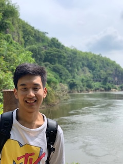
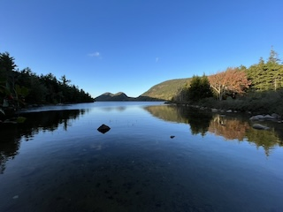
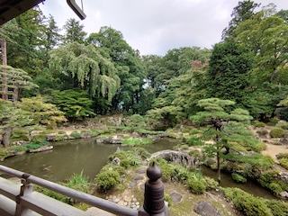
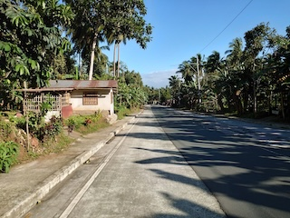

# Hi there, I'm Naoya Morishita👋
I am a consultant for **international development projects with a specialization in GIS and remote sensing.**
I am especially interested in **spatial analysis for environmental conservation projects** using open- source software, such as QGIS, Python, R, PostgreSQL, and Julia (a little bit).
Recenlty, I started learning web mapping technology too.
Occasionally, I also use commercial software such as GoogleEarthEngine and ArcGIS Pro.

In my free time, I like listening music, visiting nature and historical places, and watching comedy shows.
Plus, I like to coding and I'm currently learning Java and Scala languages.

 

## Experiences
Also visit [my resume](https://docs.google.com/document/d/1ijZtEYsCy4wlroVGakiaZGIpIcOqZZFoT6h-3xpDmWk/edit?usp=sharing).

### Industory
#### International Development Consultant (July 2024~)
I have been working for some GIS projects, such as **running GIS seminers in an Oceanian country for forestory application**, **preliminary analysis for REDD+ application**, and **research on cloud native GIS utilization.**

#### Other part- time jobs 
- When I was an undergraduate student, I was **a teacher of a supplementary school** in Yokohama, teaching Japanese history, English, and Japanese to elementary ~ high school students.
- Also when I was an undergraduate student, I was **working for a computer shop** to teach computer skills and fix technical problems of customers.

### Education
#### Master of Science in Geographic Information Science
*[Geographic Information Science, M.S., Clark University](https://www.clarku.edu/programs/masters/geographic-information-science-ms/) (Completed in May 2024 with GPA of 3.98)*

I learned fundamental~ advanced **GIS and remote sensing and how they can be incorporated into conservation projects.** I wrote **thesis about forest morphology and fragmentation in comparison with American black bears' homerange** which I presented at some conferences (See below).

#### Bachelor of Arts and Sciences, major in International Business
*[School of Global Studies and Collaboration, Aoyama Gakuin University](https://www.aoyama.ac.jp/en/academic/undergraduate/gsc/) (Completed in Mar 2022)*

I learned **theoretical backgrounds about international development, industory, and Southeast Asian studies (completed in Mar 2022)**. I also joined **5- month exchange program at [Thammasat University](https://tu.ac.th/en)** where I deepened my understanding about the country from lecturers, students, and residents. I also conducted a field research about renewable energy perception of the students.

##### Leadership Experiences
*[AIESEC](https://aiesec.org) in Aoyama Gakuin University*

I joined to help students experiencing international volunteering and internship. I also experienced a volunteering program and **taught environmental issuses at a local kindergarten in Philippines for 6 weeks.** 

In 2020, I was one of executive board of the local committee, and due to the COVID19, we had to cancell all exchange projects. We organized several events, such as online conferences to maintain the organization and its philosophy even under such catastorophe.

#### Other Online Courses
- [Landscape Ecology](https://drive.google.com/file/d/1dHDsb4criQKbVJMupAKrU_rGuc3bFMUw/view?usp=sharing) by ETH Zurich
- [Conservation Ecology](https://drive.google.com/file/d/15k8ShLK5vE3C619Qdl-N4H_LAEAscX9a/view?usp=sharing) by American Museum of Natural History
- [Programming](https://drive.google.com/file/d/1YJccMzebTXIdLNOrHuIpP-dfA_wZ53_Y/view?usp=sharing), [ML & AI](https://drive.google.com/file/d/1K3BidFksVIzJzeyVH5FxiqKm6yLhshoD/view?usp=sharing) (with [Python](https://drive.google.com/file/d/1yDNTTXXLZ6nQ4tm0c2QF3lfiaxpHiCrO/view?usp=sharing)), [Data Analysis](https://drive.google.com/file/d/1LpEq5fhV-XX4A3liiJKM1x6qt8cb2jIf/view?usp=sharing) by LinkedIn Learning
- [Intro to SAR](https://drive.google.com/file/d/1ztXKeByR3P3V-6qKtt5EuXAtV_-W8ayz/view?usp=sharing) by NASA

### Projects & Conference Poster
- Master's Thesis
    - [Chapter1](https://drive.google.com/file/d/1v95dtnStOPnyLN8tAxUJsYyh5a1dnrAG/view?usp=sharing): 2 time points comparison of forest morphology and fragmentation at the State level. (Presented at Graduate Student Multidisciplinary Conference at Clark University)
    - [Chapter2](https://drive.google.com/file/d/1KTwdp9Vc1m3MdMPhjuuXkAoh-fcOZSoI/view?usp=sharing): Modeling bear sighting locations in relation to forest morphology and fragmentation (Presented at [AAG Annual Meeting](https://www.aag.org)).
    - [Chapter3](https://drive.google.com/file/d/1-XQnP7SMEBXeoL6QF7A_Z-PsrLKH_6yW/view?usp=sharing): 2 time points comparison of forest morphology and at the municipality level. (Presented at [Northeast Arc Users Group](https://www.northeastarc.org) Conference)
- [Mangrove damage identification](https://code.earthengine.google.com/063ff9e04d1d0fde236d127a250fa4e2) using satellite imagery from a work with Wildlife Conservation Society.
- [Geospatial Analysis with R Project Poster](https://drive.google.com/file/d/1przSzgX2w7Bu-Xe5GC-tGOCgut8wtvqH/view?usp=sharing): Nighttime radiance and public housing in Miami (Presented at [The New England-St. Lawrence Valley Geographical Society](https://nestval.aag.org) Conference).
- Also I'm writing an article as a co- first author about forest morphology analysis with machine learning.
- Some of Jupyter Notebooks are available at [my main repository](https://github.com/naoyamorishita/main).