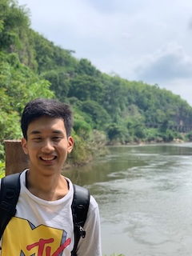
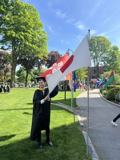
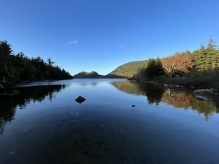

# Naoya Morishita, a GIScientist🗾
> "As important as the result is the way you do things." 
> *-  JR, from [his TED Talk](https://www.ted.com/talks/jr_my_wish_use_art_to_turn_the_world_inside_out)*

## Introduction
- 🗺️ I am a (geo) data scientist and international development consultnat.
- 🐍 I am interested in GIS/ remote sensing for environmental conservation with open- sourced solutions.
- 🧑🏻‍💻 I use Python, R, PostgreSQL, GoogleEarthEngine, a little of Julia, as well as QGIS.
- ✍️ I am learning Java and Scala.
- 🎓 I have M.S in Geographic Information Science ('24) and B.A.S in International Development ('22).
- ✈️ My favorite pastimes are visiting beautiful places and watching comedy show (Some photos are at [the bottom](#some-of-my-favorite-photos)).

### Also visit
- [Myself in 150words](.summary.md)
- [My resume](https://docs.google.com/document/d/1ijZtEYsCy4wlroVGakiaZGIpIcOqZZFoT6h-3xpDmWk/edit?usp=sharing).
- [Projects](#projects--conference-posters),  [Industory Experience](#industory), [Academic Experience](#education), or [Contact](#contact) in this page.

## Projects & Conference Posters
- Master's Thesis
    - [Chapter1](https://drive.google.com/file/d/1v95dtnStOPnyLN8tAxUJsYyh5a1dnrAG/view?usp=sharing): 2 time points comparison of forest morphology and fragmentation at the State level. (Presented at Graduate Student Multidisciplinary Conference at Clark University)
    - [Chapter2](https://drive.google.com/file/d/1KTwdp9Vc1m3MdMPhjuuXkAoh-fcOZSoI/view?usp=sharing): Modeling bear sighting locations in relation to forest morphology and fragmentation (Presented at [AAG Annual Meeting](https://www.aag.org)).
    - [Chapter3](https://drive.google.com/file/d/1-XQnP7SMEBXeoL6QF7A_Z-PsrLKH_6yW/view?usp=sharing): 2 time points comparison of forest morphology and at the municipality level. (Presented at [Northeast Arc Users Group](https://www.northeastarc.org) Conference)
- [Mangrove damage identification using satellite imagery](https://code.earthengine.google.com/063ff9e04d1d0fde236d127a250fa4e2) from a work with Wildlife Conservation Society.
- [Geospatial Analysis with R Project Poster](https://drive.google.com/file/d/1przSzgX2w7Bu-Xe5GC-tGOCgut8wtvqH/view?usp=sharing): Nighttime radiance and public housing in Miami (Presented at [The New England-St. Lawrence Valley Geographical Society](https://nestval.aag.org) Conference).
- Paper under preperation for [AI for Landscape Ecology](https://link.springer.com/collections/aaidbjichg)
- Some of Jupyter Notebooks at [my main repository](https://github.com/naoyamorishita/main).

## Detailed Experiences
### Industory
#### International Development Consultant (Jul 2024~)
- Working for projects including, but not limited to, **GIS seminers in an Oceanian country for forestory application**, **preliminary analysis for REDD+ application**, and **research on cloud native GIS utilization.**

#### Other part- time jobs during
- *Teacher of a supplementary school:* taught Japanese history, English, and Japanese to elementary ~ high school students.
- *Employee at a computer shop:* taught computer skills to and fix technical problems from customers, and managed some backyard operations.

### Education
#### Master of Science in Geographic Information Science (~May 2024)
*[Geographic Information Science, M.S., Clark University](https://www.clarku.edu/programs/masters/geographic-information-science-ms/) (GPA of 3.98)*
- Studied **GIS and remote sensing and how they can be incorporated into conservation projects**.
- Also see the [Projects](#projects--conference-posters).

##### Leadership Experiences
- *TA in a Japanese Class:* organized and led 2 discussion sessions to help students learn written and verbal communication in Japanese.

#### Bachelor of Arts and Sciences, major in International Development and Business (~Mar 2022)
*[School of Global Studies and Collaboration, Aoyama Gakuin University](https://www.aoyama.ac.jp/en/academic/undergraduate/gsc/)*
- Studied **international development, industory, and Southeast Asian studies**.
- Also studied fundamental science subjects such as **statistics, fieldworking methods, and academic writing and presentation in English**

##### International & Leadership Experiences
- *5- month exchange program at [Thammasat University](https://tu.ac.th/en) in Thailand*
    - Studied ASEAN and Chinese politics, economics, and history in one of the ASEAN country.
    - Conducted a field study about feasibility and perception about renewable energy in Bangkok.
- *[AIESEC](https://aiesec.org) in Aoyama Gakuin University*
    - Helped students experience international volunteering and internship.
    - Participated in a volunteering project to teach community kindergarten students about environmental issues in the Philippines for 6 weeks.
    - Ran the local committee in 2020 (i.e., COVID outbreak year) as an executive member.
        - Organized lots of events such as online international dialogues to maintain the organization and its philosophy.

#### Other Online Courses
- [Landscape Ecology](https://drive.google.com/file/d/1dHDsb4criQKbVJMupAKrU_rGuc3bFMUw/view?usp=sharing) by ETH Zurich
- [Conservation Ecology](https://drive.google.com/file/d/15k8ShLK5vE3C619Qdl-N4H_LAEAscX9a/view?usp=sharing) by American Museum of Natural History
- [Programming](https://drive.google.com/file/d/1YJccMzebTXIdLNOrHuIpP-dfA_wZ53_Y/view?usp=sharing), [ML & AI](https://drive.google.com/file/d/1K3BidFksVIzJzeyVH5FxiqKm6yLhshoD/view?usp=sharing) (with [Python](https://drive.google.com/file/d/1yDNTTXXLZ6nQ4tm0c2QF3lfiaxpHiCrO/view?usp=sharing)), [Data Analysis](https://drive.google.com/file/d/1LpEq5fhV-XX4A3liiJKM1x6qt8cb2jIf/view?usp=sharing) by LinkedIn Learning
- [Intro to SAR](https://drive.google.com/file/d/1ztXKeByR3P3V-6qKtt5EuXAtV_-W8ayz/view?usp=sharing) by NASA

## Some of my favorite photos
Photos are from [Acadia NP](https://www.nps.gov/acad/index.htm) and [Erin- ji temple](https://www.yamanashi-kankou.jp/english/uncover/erinji-temple.html).

  

## Contact
- [Email](mailto:0zh4772g325515u64@gmail.com)
- [LinkedIn](https://www.linkedin.com/in/naoya-morishita-705393254/)
- [Facebook](https://www.facebook.com/naoya.morishita.56/)
