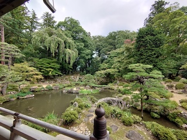
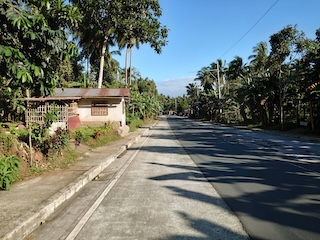

# Hi there, I'm Naoya Morishita, a GIScientist👋
## Summary
I’m currently working at a geospatial consultancy company that works for Japanese Organization Development Assistance Projects. 
My particular interest is geographic information science application for environmental conservation with open- sourced solutions. 
Some of my projects were 1) teaching GIS to forestry workers in a Pacific country, 2) researching cloud native geospatial solutions for ODA projects, and 3) analyzing deforestation and potential carbon emission for a climate mitigation framework (REDD+) application. 
I achieved most of the tasks with open- sourced software such as Python and QGIS.

Before joining the company, I completed M.S. in Geographic Information Science at Clark University and B.A.S. in International Development at Aoyama Gakuin University. 
In the graduate school, my thesis analyzed forest morphology, fragmentation and bear sightings in Massachusetts using Python and R. 
Moreover, I and my team worked with Wildlife Conservation Society, and I identified potential damage in mangrove forest in Sundarbans in Bangladesh.

### More about Me
#### What I am good at
🗺️ Data Analytics, Geographic Information Science, and Remote Sensing. 
🧑🏻‍💻 Programming languages: Python, R, PostgreSQL, and GoogleEarthEngine + a little bit of Java, Julia, and Scala. 
🐘 Theoretical background of International Development, Southeast Asian studies, and environmental studies and ecology. 
👨‍💼 Working logically, creatively, and autonomously.

#### What I like
✈️ Visiting natural places and historical places. 
🎙️ Watching comedy. 
🎧 Listening to music.

Jump to [Projects](projects--conference-poster),  [Industory Experience](#industory), [Academic Experience](#education), or [Contact](#contact)

  

## Projects & Conference Posters
- Master's Thesis
    - [Chapter1](https://drive.google.com/file/d/1v95dtnStOPnyLN8tAxUJsYyh5a1dnrAG/view?usp=sharing): 2 time points comparison of forest morphology and fragmentation at the State level. (Presented at Graduate Student Multidisciplinary Conference at Clark University)
    - [Chapter2](https://drive.google.com/file/d/1KTwdp9Vc1m3MdMPhjuuXkAoh-fcOZSoI/view?usp=sharing): Modeling bear sighting locations in relation to forest morphology and fragmentation (Presented at [AAG Annual Meeting](https://www.aag.org)).
    - [Chapter3](https://drive.google.com/file/d/1-XQnP7SMEBXeoL6QF7A_Z-PsrLKH_6yW/view?usp=sharing): 2 time points comparison of forest morphology and at the municipality level. (Presented at [Northeast Arc Users Group](https://www.northeastarc.org) Conference)
- [Mangrove damage identification](https://code.earthengine.google.com/063ff9e04d1d0fde236d127a250fa4e2) using satellite imagery from a work with Wildlife Conservation Society.
- [Geospatial Analysis with R Project Poster](https://drive.google.com/file/d/1przSzgX2w7Bu-Xe5GC-tGOCgut8wtvqH/view?usp=sharing): Nighttime radiance and public housing in Miami (Presented at [The New England-St. Lawrence Valley Geographical Society](https://nestval.aag.org) Conference).
- Also I'm writing an article as a co- first author about forest morphology with machine learning.
- Some of Jupyter Notebooks are available at [my main repository](https://github.com/naoyamorishita/main).

## Detailed Experiences
Also visit [my resume](https://docs.google.com/document/d/1ijZtEYsCy4wlroVGakiaZGIpIcOqZZFoT6h-3xpDmWk/edit?usp=sharing).

### Industory
#### International Development Consultant (Jul 2024~)
I have been working for some GIS projects, such as **running GIS seminers in an Oceanian country for forestory application**, **preliminary analysis for REDD+ application**, and **research on cloud native GIS utilization.**

#### Other part- time jobs 
- When I was an undergraduate student, I was **a teacher of a supplementary school** in Yokohama, teaching Japanese history, English, and Japanese to elementary ~ high school students.
- Also when I was an undergraduate student, I was **working for a computer shop** to teach computer skills to and fix technical problems from customers.

### Education
#### Master of Science in Geographic Information Science (~May 2024)
*[Geographic Information Science, M.S., Clark University](https://www.clarku.edu/programs/masters/geographic-information-science-ms/) (GPA of 3.98)*

I learned fundamental~ advanced **GIS and remote sensing and how they can be incorporated into conservation projects**.  
I wrote **thesis about forest morphology and fragmentation in comparison with American black bears' homerange** which I presented at conferences (See [Projects](projects--conference-poster)).

##### Leadership Experiences
*Teaching Assistant in Japanese Language Class*

I led discussion sessions where students were able to learn how to communicate in Japanese.

#### Bachelor of Arts and Sciences, major in International Development and Business (~Mar 2022)
*[School of Global Studies and Collaboration, Aoyama Gakuin University](https://www.aoyama.ac.jp/en/academic/undergraduate/gsc/)*

I learned theoretical backgrounds about **international development, industory, and Southeast Asian studies**.  
I also experienced **a 5- month exchange program at [Thammasat University](https://tu.ac.th/en), Bangkok** where I deepened my understanding about the country from lecturers, students, and residents.  
I then conducted **a field research about renewable energy feasibility and perception of the students.**

##### Leadership Experiences
*[AIESEC](https://aiesec.org) in Aoyama Gakuin University*

I joined the organization to help students experience international volunteering and internship.  
I also **taught environmental issuses at a kindergarten in the Philippines for 6 weeks.** as a volunteering participant. 
In 2020, I was one of the executive board of the local committee, but due to the COVID19, we had to cancell all exchange projects. 
**We organized lots of events, such as online international dialogues to maintain the organization and its philosophy even under such catastorophe.**

#### Other Online Courses
- [Landscape Ecology](https://drive.google.com/file/d/1dHDsb4criQKbVJMupAKrU_rGuc3bFMUw/view?usp=sharing) by ETH Zurich
- [Conservation Ecology](https://drive.google.com/file/d/15k8ShLK5vE3C619Qdl-N4H_LAEAscX9a/view?usp=sharing) by American Museum of Natural History
- [Programming](https://drive.google.com/file/d/1YJccMzebTXIdLNOrHuIpP-dfA_wZ53_Y/view?usp=sharing), [ML & AI](https://drive.google.com/file/d/1K3BidFksVIzJzeyVH5FxiqKm6yLhshoD/view?usp=sharing) (with [Python](https://drive.google.com/file/d/1yDNTTXXLZ6nQ4tm0c2QF3lfiaxpHiCrO/view?usp=sharing)), [Data Analysis](https://drive.google.com/file/d/1LpEq5fhV-XX4A3liiJKM1x6qt8cb2jIf/view?usp=sharing) by LinkedIn Learning
- [Intro to SAR](https://drive.google.com/file/d/1ztXKeByR3P3V-6qKtt5EuXAtV_-W8ayz/view?usp=sharing) by NASA

## Contact
- [Email](mailto:0zh4772g325515u64@gmail.com)
- [LinkedIn](https://www.linkedin.com/in/naoya-morishita-705393254/)
- [Facebook](https://www.facebook.com/naoya.morishita.56/)
